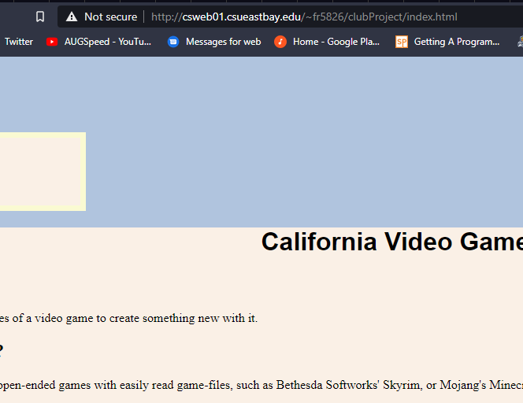
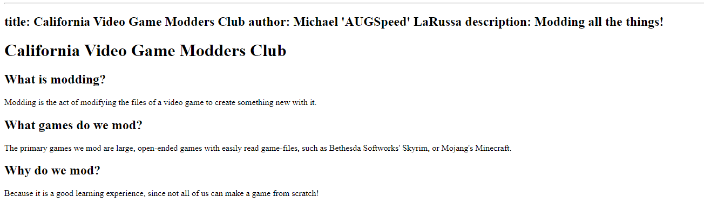
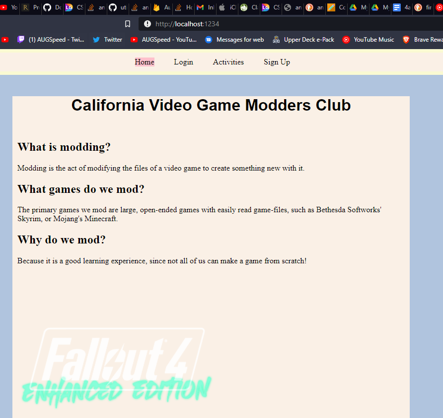
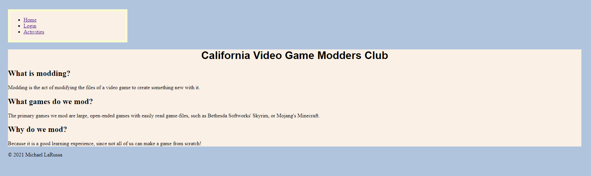
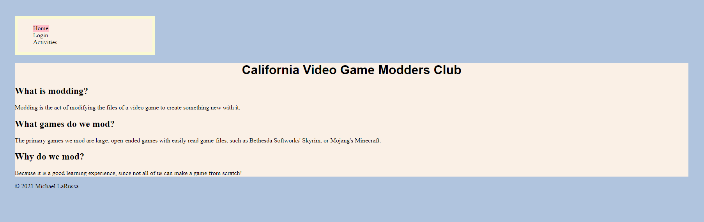
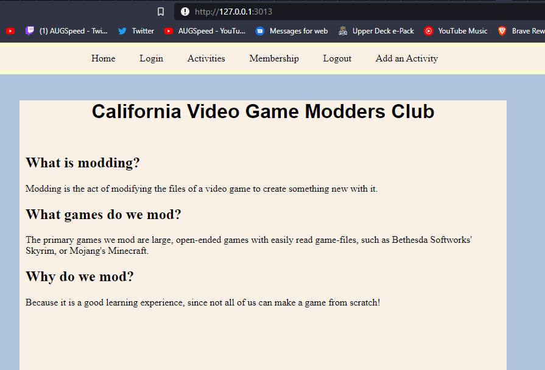

**Michael LaRussa**

**NetID: fr5826**

# Homework #2 Solution

# Question 1

## (a)

## (b)

(i) No, you should not put site-wide navigation into main.

(ii) You should not put common banners into main either.

(iii) You should not put copyright in main either.

## (c)

## (d)

## (e)

# Question 2

## (a)

We should use this inside of main for this purpose.

## (b)

Yes, it is okay to put the footer in main as well as the last thing in body. I think I would prefer it to be the last item in body, as the copyright info will not likely change from page to page.

## (c)


## (d)

```html
<!DOCTYPE html>
<html lang="en"> <!-- English -->
    <head>
		<meta charset="UTF-8">
        <title>CVGMC</title>
    </head>
    <!-- I'm an HTML comment -->
    <body>
	
		<nav>
		
			<ul>
			
				<li class = "active"><a href="index.html">Home</a></li>
				<li><a href="login.html">Login</a></li>
				<li><a href="activities.html">Activities</a></li>
			
			</ul>
		
		</nav>
	
		<main>
		
			<header>
				<h1>California Video Game Modders Club</h1>
			</header>
			
			<h2>What is modding?</h2>
			<p>Modding is the act of modifying the files of a video game to create something new with it.</p>
			<h2>What games do we mod?</h2>
			<p>The primary games we mod are large, open-ended games with easily read game-files, such as Bethesda Softworks' Skyrim, or Mojang's Minecraft.</p>
			<h2>Why do we mod?</h2>
			<p>Because it is a good learning experience, since not all of us can make a game from scratch!</p>
	
		</main>
		
		<footer>
		
			<p>&copy 2021 Michael LaRussa</p>
		
		</footer>
    </body>
</html>
```

# Question 3

## (a)

(i) We are trying to get an integer from a string that contains no numbers, so we get "NaN", or "Not a Number".

(ii) We get 12 from this one because there is actually an integer here.

(iii) This is parsing the string given, but in a different base, outputting the number in base 10. So, this one is interpreting 1010 as base 2, or binary, and that is '10' in base 10. If we replace the 2 with 10, then the result is 1010, which is 1010 in base 10.

(iiii) No, this is not the same as (ii), this gives us "NaN".


## (b)


## (c)

(i) Yes, it does work.

(ii) This does not work because the string delimiter is the same as the symbol used to denote a conjunction.

(iii) We are telling the computer that the singe quotation mark is not a string delimiter but rather a part of a string.



## (d)

(i) This simply made the name uppercase.

(ii) This made the name lowercase.

(iii) These two lines determine if there is a captial A in my upper case name, and a lowercase i in my name, and reports true if there is, and false if there isn't.



## (e)



# Question 4

## (a)

I am using the Arial font.

## (b)



## (c)
```css
nav li {
	list-style-type: none;
	display: table;
}

nav li:hover {
	background-color: LightCoral;
}

nav li:active {
	background-color: Coral;
}
```



## (d)



```css
header h1 {
	font-family: "Arial";
	text-align: center;
}

body {
	background-color: LightSteelBlue;
	margin: 2%;
	padding: 3%;
}

nav {
	background-color: Linen;
	border-style: solid;
	border-width: 7px;
	border-color: LightGoldenRodYellow;
	max-width: 20%;
}

nav li {
	list-style-type: none;
	display: table;
}

nav li:hover {
	background-color: LightCoral;
}

nav li:active {
	background-color: Coral;
}

nav a {
	text-decoration: none;
}

nav a:visited {
	color: black;
}

.active{
	background-color: Pink;
}

main {
	background-color: Linen;
}

footer {
	text-align: center;
	font-family: "Helvetica";
}
```
