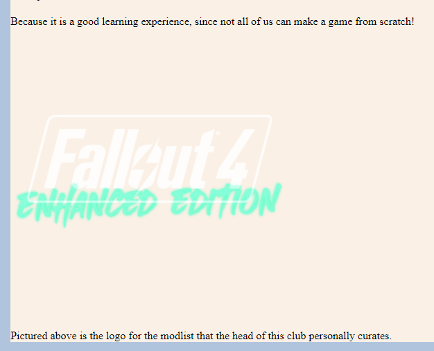
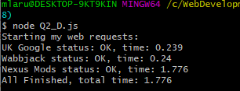
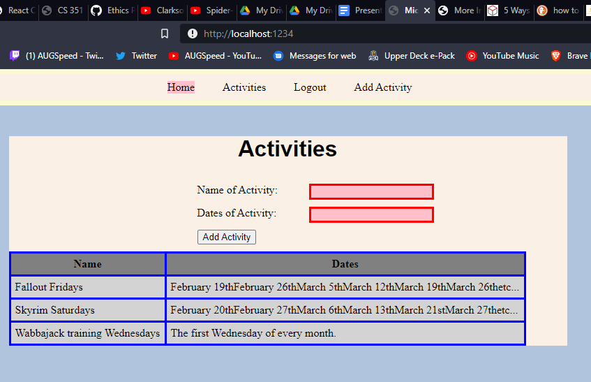

**Michael LaRussa**

**NetID: fr5826**

# Homework #4 Solution

# Question 1

## (a)

## (b)

## (c)

```javascript
function create() { 
            
			mainSection = document.getElementById("Main");
			
            var newT = document.createElement("table"); 
            newT.setAttribute("id", "EventsTable"); 
            Main.appendChild(newT); 
  
            var newR = document.createElement("tr"); 
            newR.setAttribute("id", "Row1"); 
            document.getElementById("EventsTable").appendChild(newR); 
  
            var newC = document.createElement("th"); 
            var newText = document.createTextNode("Name"); 
            newC.appendChild(newText); 
            document.getElementById("Row1").appendChild(newC); 
			
			newC = document.createElement("th"); 
			newText = document.createTextNode("Dates"); 
            newC.appendChild(newText); 
            document.getElementById("Row1").appendChild(newC);
			
			newR = document.createElement("tr"); 
            newR.setAttribute("id", "Row2"); 
            document.getElementById("EventsTable").appendChild(newR); 
			
			newC = document.createElement("td"); 
			newText = document.createTextNode(events[0].name); 
            newC.appendChild(newText); 
            document.getElementById("Row2").appendChild(newC);
			
			newC = document.createElement("td"); 
			newText = document.createTextNode(events[0].dates); 
            newC.appendChild(newText); 
            document.getElementById("Row2").appendChild(newC);
			
			newR = document.createElement("tr"); 
            newR.setAttribute("id", "Row3"); 
            document.getElementById("EventsTable").appendChild(newR); 
			
			newC = document.createElement("td"); 
			newText = document.createTextNode(events[1].name); 
            newC.appendChild(newText); 
            document.getElementById("Row3").appendChild(newC);
			
			newC = document.createElement("td"); 
			newText = document.createTextNode(events[1].dates); 
            newC.appendChild(newText); 
            document.getElementById("Row3").appendChild(newC);
			
			newR = document.createElement("tr"); 
            newR.setAttribute("id", "Row4"); 
            document.getElementById("EventsTable").appendChild(newR); 
			
			newC = document.createElement("td"); 
			newText = document.createTextNode(events[2].name); 
            newC.appendChild(newText); 
            document.getElementById("Row4").appendChild(newC);
			
			newC = document.createElement("td"); 
			newText = document.createTextNode(events[2].dates); 
            newC.appendChild(newText); 
            document.getElementById("Row4").appendChild(newC);
        }
```



# Question 2

## (a)



## (b)

```html

		<nav>
		
			<ul>
			
				<li><a href="index.html">Home</a></li>
				<li><a href="login.html">Login</a></li>
				<li><a href="activities.html">Activities</a></li>
				<li class = "active"><a href="signUp.html">Sign Up</a></li>
			
			</ul>
		
		</nav>

```

# Question 3

## (a)

```html

<header id="top">

<form action="" method="get" id="form1">

```

## (b)

```javascript
document.getElementById("form1").addEventListener('submit', function(event){
			event.preventDefault()
			var warningSection = document.getElementById("top")
			var warning = document.createElement("p")
			var text = document.createTextNode("Welcome, " + document.getElementById("email").value + " to California Video Game Modders! Currently, our site is under maintenence, please check back later!")
			warning.appendChild(text)
			warningSection.appendChild(warning)

		});
```



# Question 4

## (a)

```html
	<label for="name">Enter your name: </label>
	<input type="text" name="name" id="name" required>
	<label for="email">&#9993; Enter your email: </label>
	<input type="email" name="email" id="email" required>
	<label for="password">Enter your password: </label>
	<input type="password" name="password" id="password" minlength=7 required>
```

## (b)

## (c)

```javascript
document.getElementById("form1").addEventListener('submit', function(event){
			event.preventDefault()
			var ThanksSection = document.getElementById("ThanksDialog")
			var thanks = document.createElement("p")
			var text = document.createTextNode("Thanks for Applying!")
			
			ThanksSection.classList.toggle("show");
			
			thanks.appendChild(text)
			ThanksSection.appendChild(thanks)
			
			thanks = document.createElement("p")
			text = document.createTextNode("Your Name: " + document.getElementById("name").value + ", email: " + document.getElementById("email").value + ", preferred game: " + document.getElementById("game").value)
			thanks.appendChild(text)
			var close = document.createElement("button")
			close.innerHTML = "Close"
			close.setAttribute("id", "close")
			ThanksSection.appendChild(thanks)
			ThanksSection.appendChild(close)
			close.addEventListener("click", remove)
		});
		
		function remove(){
			document.getElementById("ThanksDialog").classList.toggle("show")
		}
```

#Question 5

## (a)

http://csweb01.csueastbay.edu/~fr5826/clubProject/signUp.html


