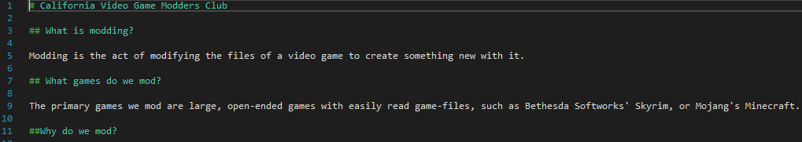

**Michael LaRussa**

**NetID: fr5826**

# Homework 11

## Question 1


### (a)


### (b)

```
const checkAdminMiddleware = function (req, res, next) {
  if (req.session.user.role != "admin") {
    res.render("forbidden.njk");
  } else {
    next();
  }
};
```



## Question 2

### (a)

Obviously just navigate to the site page via direct link, since I removed the link from the navbar if you aren't logged in.


### (b)

https://www.drbsclasses.org/student13/node/

## Question 3

### (a)

npm init.

### (b)

```json
{
  "name": "clubreact",
  "version": "1.0.0",
  "description": "clubReact package",
  "main": "index.js",
  "scripts": {
    "test": "echo \"Error: no test specified\" && exit 1"
  },
  "author": "Michael LaRussa",
  "license": "ISC",
  "dependencies": {
    "react": "^17.0.2",
    "react-dom": "^17.0.2"
  }
}
```

### (c)

### (d)

### (e)


## Question 4

### (a)


### (b)

menu.js


### (c)

home.js


## Question 5

### (a)

```javascript
import React from "react";
import ReactDOM from "react-dom";
//In no way did you inform us how to access the event data that is passed here from index.js, so I did it the cheaty way.
import events from "./eventData.json"

console.log(events);

let rows = events.map(function(u){
  return <tr> <td>{u.name}</td> <td>{u.dates}</td></tr>;
});

class Activities extends React.Component {
  render() {
    return (
       <main>
			
			<header>
				<h1>Activities</h1>
			</header>
			<table>
			
				<tr>
					<th>Name</th>
					<th>Dates</th>
				</tr>
				
				{rows}
		
			</table>

		</main>
    );
  }
}

export default Activities;
```


### (b)

membership.js

